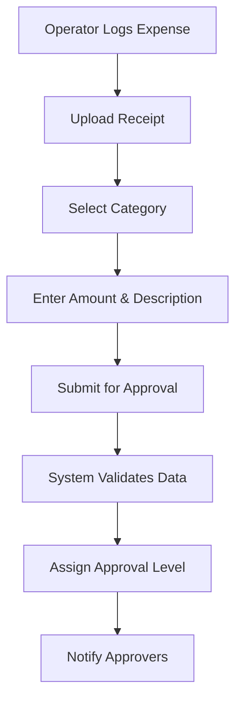
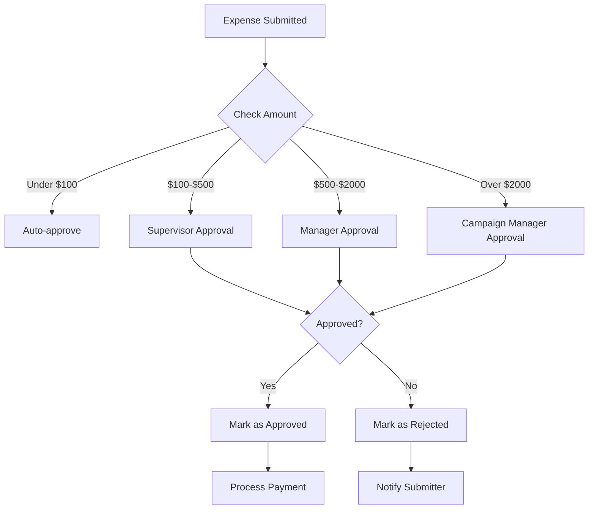
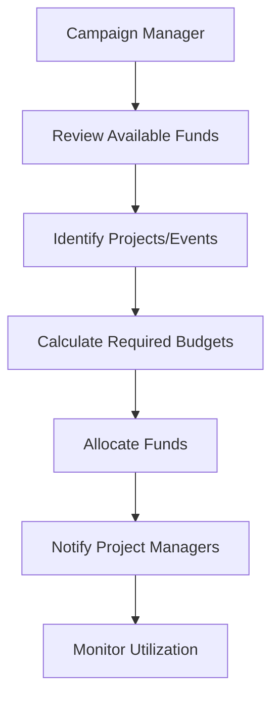
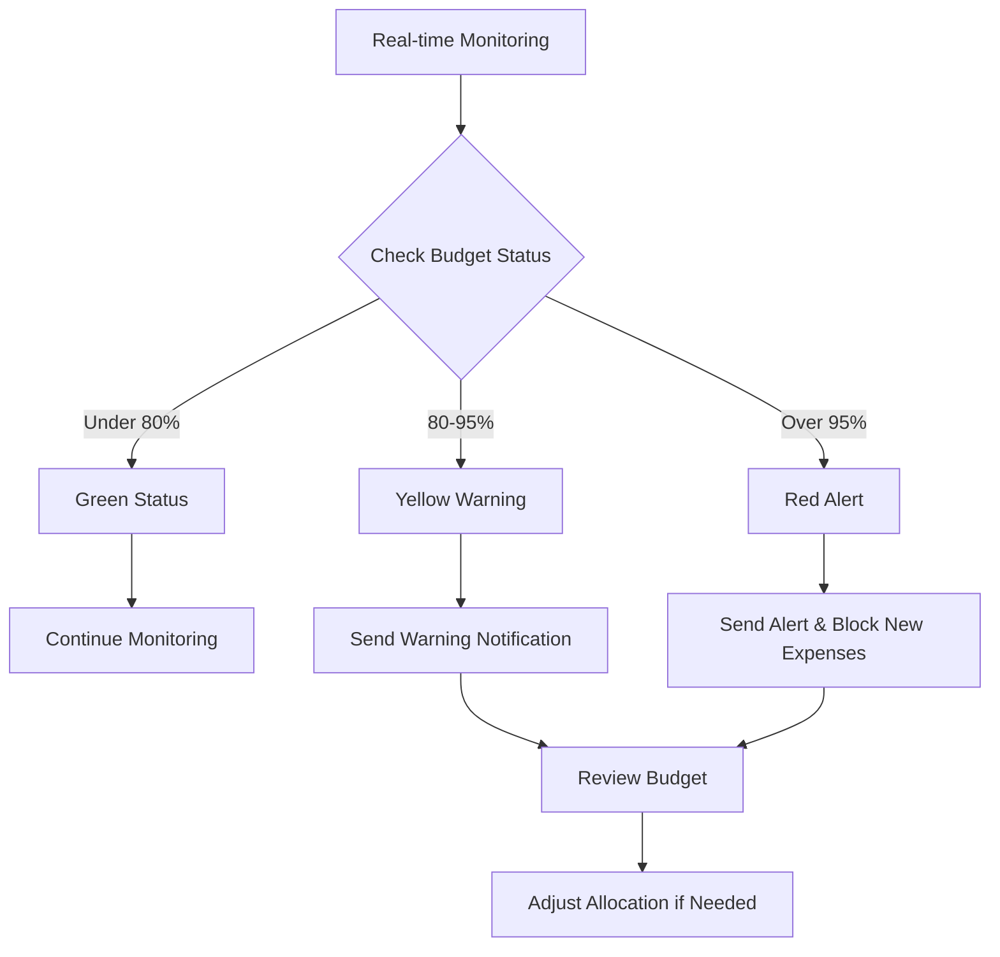

# Funds and Expenses Management Module

## Table of Contents
1. [Overview](#overview)
2. [Module Architecture](#module-architecture)
3. [Key Features](#key-features)
4. [User Roles & Permissions](#user-roles--permissions)
5. [Database Design](#database-design)
6. [API Documentation](#api-documentation)
7. [Frontend Components](#frontend-components)
8. [Workflow & Processes](#workflow--processes)
9. [Integration Points](#integration-points)
10. [Security & Compliance](#security--compliance)
11. [Reporting & Analytics](#reporting--analytics)
12. [Configuration](#configuration)
13. [Testing](#testing)
14. [Future Enhancements](#future-enhancements)

---

## Overview

The **Funds and Expenses Management Module** is a comprehensive financial management system designed to track, monitor, and report on all campaign financial activities within the Somaliland Candidate Helper application. This module ensures financial transparency, compliance, and effective resource allocation throughout the campaign lifecycle.

### Purpose
- **Financial Transparency**: Provide complete visibility into campaign finances
- **Resource Allocation**: Optimize fund distribution across campaign activities
- **Expense Tracking**: Monitor and categorize all campaign expenditures
- **Compliance**: Ensure adherence to financial regulations and reporting requirements
- **Audit Trail**: Maintain detailed records for accountability and auditing

### Target Users
- **Campaign Managers**: Full financial oversight and decision-making
- **Finance Officers**: Daily financial operations and data entry
- **Operators**: Field expense logging and fund requests
- **Auditors**: Financial review and compliance verification
- **Administrators**: System configuration and user management

---

## Module Architecture

### System Integration
```
┌─────────────────────────────────────────────────────────────┐
│                Funds & Expenses Module                      │
├─────────────────────────────────────────────────────────────┤
│  ┌─────────────┐  ┌─────────────┐  ┌─────────────┐        │
│  │   Fund      │  │  Expense    │  │  Budget     │        │
│  │ Management  │  │  Tracking   │  │  Allocation │        │
│  └─────────────┘  └─────────────┘  └─────────────┘        │
│  ┌─────────────┐  ┌─────────────┐  ┌─────────────┐        │
│  │ Financial   │  │  Approval   │  │  Reporting  │        │
│  │ Reporting   │  │  Workflow   │  │  & Analytics│        │
│  └─────────────┘  └─────────────┘  └─────────────┘        │
└─────────────────────────────────────────────────────────────┘
         │                    │                    │
         ▼                    ▼                    ▼
┌─────────────┐    ┌─────────────┐    ┌─────────────┐
│   Event     │    │   Operator  │    │  Supporter  │
│ Management  │    │ Management  │    │ Management  │
└─────────────┘    └─────────────┘    └─────────────┘
```

### Data Flow
1. **Fund Allocation** → Campaign Manager assigns budgets to projects/events
2. **Expense Recording** → Finance Officers/Operators log expenses
3. **Approval Process** → Multi-level approval workflow for expenses
4. **Budget Monitoring** → Real-time tracking of budget vs. actual spending
5. **Reporting** → Generate financial reports and analytics

---

## Key Features

### 1. Fund Management
- **Fund Sources**: Track different funding sources (donations, grants, personal funds)
- **Budget Allocation**: Assign budgets to specific projects, events, or categories
- **Fund Transfers**: Move funds between different budget categories
- **Fund Tracking**: Monitor fund utilization and remaining balances
- **Multi-Currency Support**: Handle different currencies for international campaigns

### 2. Expense Tracking
- **Real-time Logging**: Immediate expense entry with mobile support
- **Category Management**: Organize expenses by type (transportation, materials, personnel, etc.)
- **Receipt Management**: Digital receipt storage and verification
- **Approval Workflow**: Multi-level approval process for different expense amounts
- **Expense Validation**: Automated validation against budget limits and policies

### 3. Budget Management
- **Budget Planning**: Create and manage annual, quarterly, and project budgets
- **Variance Analysis**: Compare actual vs. planned expenditures
- **Budget Alerts**: Notifications when approaching or exceeding budget limits
- **Budget Adjustments**: Modify budgets based on changing campaign needs
- **Forecasting**: Predictive analytics for future financial needs

### 4. Financial Reporting
- **Real-time Dashboards**: Live financial overview and key metrics
- **Custom Reports**: Generate reports for specific time periods, categories, or projects
- **Export Capabilities**: Export data to Excel, PDF, or accounting software
- **Compliance Reports**: Generate reports for regulatory compliance
- **Audit Reports**: Detailed transaction logs for auditing purposes

### 5. Approval Workflow
- **Multi-level Approval**: Different approval levels based on expense amount
- **Digital Signatures**: Electronic approval and authorization
- **Approval History**: Complete audit trail of all approvals
- **Escalation Rules**: Automatic escalation for overdue approvals
- **Notification System**: Email and SMS notifications for pending approvals

---

## User Roles & Permissions

### Campaign Manager
**Full Financial Control**:
- Create and modify budgets
- Allocate funds to projects/events
- Approve all expense categories
- Access all financial reports
- Configure approval workflows
- Manage user permissions

### Finance Officer
**Financial Operations**:
- Record and categorize expenses
- Process approved expenses
- Generate financial reports
- Monitor budget utilization
- Manage receipt verification
- Handle fund transfers

### Operator
**Field Financial Activities**:
- Log field expenses
- Submit expense reports
- Request fund allocations
- View assigned budgets
- Upload receipt images
- Track personal expense limits

### Auditor
**Financial Review**:
- View all financial data (read-only)
- Generate audit reports
- Access transaction history
- Export financial data
- Review approval workflows
- Verify compliance

### Administrator
**System Management**:
- Configure financial settings
- Manage user roles and permissions
- Set up approval workflows
- Configure reporting templates
- Manage system integrations
- Monitor system performance

---

## Database Design

### Core Tables

#### Funds Table
```sql
CREATE TABLE funds (
  id BIGSERIAL PRIMARY KEY,
  title VARCHAR(255) NOT NULL,
  description TEXT,
  amount DECIMAL(15,2) NOT NULL,
  currency VARCHAR(3) DEFAULT 'USD',
  source VARCHAR(100) NOT NULL,
  category VARCHAR(100) NOT NULL,
  status VARCHAR(50) DEFAULT 'active',
  allocated_amount DECIMAL(15,2) DEFAULT 0,
  remaining_amount DECIMAL(15,2),
  created_by BIGINT REFERENCES users(id),
  created_at TIMESTAMP DEFAULT NOW(),
  updated_at TIMESTAMP DEFAULT NOW(),
  deleted_at TIMESTAMP
);
```

#### Expenses Table
```sql
CREATE TABLE expenses (
  id BIGSERIAL PRIMARY KEY,
  title VARCHAR(255) NOT NULL,
  description TEXT,
  amount DECIMAL(15,2) NOT NULL,
  currency VARCHAR(3) DEFAULT 'USD',
  category VARCHAR(100) NOT NULL,
  subcategory VARCHAR(100),
  project_id BIGINT REFERENCES projects(id),
  event_id BIGINT REFERENCES events(id),
  operator_id BIGINT REFERENCES operators(id),
  status VARCHAR(50) DEFAULT 'pending',
  approval_level INTEGER DEFAULT 1,
  approved_by BIGINT REFERENCES users(id),
  approved_at TIMESTAMP,
  receipt_url VARCHAR(500),
  receipt_verified BOOLEAN DEFAULT FALSE,
  created_by BIGINT REFERENCES users(id),
  created_at TIMESTAMP DEFAULT NOW(),
  updated_at TIMESTAMP DEFAULT NOW()
);
```

#### Budget Allocations Table
```sql
CREATE TABLE budget_allocations (
  id BIGSERIAL PRIMARY KEY,
  fund_id BIGINT REFERENCES funds(id),
  project_id BIGINT REFERENCES projects(id),
  event_id BIGINT REFERENCES events(id),
  allocated_amount DECIMAL(15,2) NOT NULL,
  spent_amount DECIMAL(15,2) DEFAULT 0,
  remaining_amount DECIMAL(15,2),
  status VARCHAR(50) DEFAULT 'active',
  allocated_by BIGINT REFERENCES users(id),
  created_at TIMESTAMP DEFAULT NOW(),
  updated_at TIMESTAMP DEFAULT NOW()
);
```

#### Expense Categories Table
```sql
CREATE TABLE expense_categories (
  id BIGSERIAL PRIMARY KEY,
  name VARCHAR(100) NOT NULL,
  description TEXT,
  parent_id BIGINT REFERENCES expense_categories(id),
  approval_threshold DECIMAL(15,2),
  requires_receipt BOOLEAN DEFAULT TRUE,
  is_active BOOLEAN DEFAULT TRUE,
  created_at TIMESTAMP DEFAULT NOW(),
  updated_at TIMESTAMP DEFAULT NOW()
);
```

#### Approval Workflows Table
```sql
CREATE TABLE approval_workflows (
  id BIGSERIAL PRIMARY KEY,
  name VARCHAR(255) NOT NULL,
  description TEXT,
  category_id BIGINT REFERENCES expense_categories(id),
  min_amount DECIMAL(15,2),
  max_amount DECIMAL(15,2),
  approval_levels JSONB NOT NULL,
  is_active BOOLEAN DEFAULT TRUE,
  created_at TIMESTAMP DEFAULT NOW(),
  updated_at TIMESTAMP DEFAULT NOW()
);
```

### Relationships
- Funds → Budget Allocations (1:many)
- Budget Allocations → Projects/Events (many:1)
- Expenses → Categories (many:1)
- Expenses → Operators (many:1)
- Expenses → Approval Workflows (many:1)
- Users → Expenses (1:many for created_by/approved_by)

---

## API Documentation

### Fund Management Endpoints

#### List Funds
```http
GET /api/funds
Query Parameters:
- page: number (default: 1)
- limit: number (default: 20)
- status: string (active, inactive, depleted)
- category: string
- source: string
- search: string

Response:
{
  "data": [
    {
      "id": 1,
      "title": "Campaign Fund 2025",
      "description": "Main campaign funding",
      "amount": 100000.00,
      "currency": "USD",
      "source": "donations",
      "category": "general",
      "status": "active",
      "allocated_amount": 75000.00,
      "remaining_amount": 25000.00,
      "created_at": "2025-01-01T00:00:00Z"
    }
  ],
  "pagination": {
    "page": 1,
    "limit": 20,
    "total": 1,
    "totalPages": 1
  }
}
```

#### Create Fund
```http
POST /api/funds
Content-Type: application/json

{
  "title": "Event Fund",
  "description": "Funding for campaign events",
  "amount": 50000.00,
  "currency": "USD",
  "source": "grants",
  "category": "events"
}

Response:
{
  "data": {
    "id": 2,
    "title": "Event Fund",
    "amount": 50000.00,
    "remaining_amount": 50000.00,
    "status": "active",
    "created_at": "2025-01-15T10:30:00Z"
  },
  "message": "Fund created successfully"
}
```

### Expense Management Endpoints

#### List Expenses
```http
GET /api/expenses
Query Parameters:
- page: number
- limit: number
- status: string (pending, approved, rejected, paid)
- category: string
- operator_id: number
- project_id: number
- event_id: number
- date_from: string (ISO date)
- date_to: string (ISO date)

Response:
{
  "data": [
    {
      "id": 1,
      "title": "Transportation to Rally",
      "amount": 150.00,
      "currency": "USD",
      "category": "transportation",
      "status": "approved",
      "operator": {
        "id": 5,
        "name": "Ahmed Hassan"
      },
      "event": {
        "id": 3,
        "title": "Hargeisa Rally"
      },
      "created_at": "2025-01-15T09:00:00Z"
    }
  ],
  "pagination": { ... }
}
```

#### Create Expense
```http
POST /api/expenses
Content-Type: application/json

{
  "title": "Office Supplies",
  "description": "Pens, papers, and printing materials",
  "amount": 75.50,
  "category": "office_supplies",
  "project_id": 1,
  "receipt_url": "https://storage.example.com/receipts/receipt_001.pdf"
}

Response:
{
  "data": {
    "id": 2,
    "title": "Office Supplies",
    "amount": 75.50,
    "status": "pending",
    "approval_level": 1,
    "created_at": "2025-01-15T11:00:00Z"
  },
  "message": "Expense submitted for approval"
}
```

#### Approve/Reject Expense
```http
PUT /api/expenses/{id}/approve
Content-Type: application/json

{
  "action": "approve", // or "reject"
  "comments": "Approved for campaign activities"
}

Response:
{
  "data": {
    "id": 2,
    "status": "approved",
    "approved_by": 1,
    "approved_at": "2025-01-15T12:00:00Z"
  },
  "message": "Expense approved successfully"
}
```

### Budget Management Endpoints

#### Allocate Budget
```http
POST /api/budget-allocations
Content-Type: application/json

{
  "fund_id": 1,
  "project_id": 2,
  "allocated_amount": 10000.00
}

Response:
{
  "data": {
    "id": 1,
    "fund_id": 1,
    "project_id": 2,
    "allocated_amount": 10000.00,
    "remaining_amount": 10000.00,
    "status": "active"
  },
  "message": "Budget allocated successfully"
}
```

### Reporting Endpoints

#### Financial Summary
```http
GET /api/financial-summary
Query Parameters:
- period: string (daily, weekly, monthly, quarterly, yearly)
- start_date: string (ISO date)
- end_date: string (ISO date)

Response:
{
  "data": {
    "total_funds": 150000.00,
    "allocated_funds": 120000.00,
    "remaining_funds": 30000.00,
    "total_expenses": 85000.00,
    "pending_expenses": 5000.00,
    "expenses_by_category": {
      "transportation": 25000.00,
      "materials": 20000.00,
      "personnel": 30000.00,
      "events": 10000.00
    },
    "monthly_trends": [
      {
        "month": "2025-01",
        "expenses": 15000.00,
        "budget": 20000.00
      }
    ]
  }
}
```

---

## Frontend Components

### Fund Management Components

#### FundDataTable
```typescript
interface FundDataTableProps {
  funds: Fund[];
  onEdit: (fund: Fund) => void;
  onDelete: (fundId: number) => void;
  onAllocate: (fund: Fund) => void;
  loading?: boolean;
}

// Features:
// - Sortable columns (amount, date, status)
// - Filter by status, category, source
// - Search functionality
// - Pagination
// - Action buttons (Edit, Delete, Allocate)
```

#### FundManagementForm
```typescript
interface FundManagementFormProps {
  fund?: Fund;
  onSubmit: (data: FundFormData) => void;
  onCancel: () => void;
  loading?: boolean;
}

// Features:
// - Form validation with Zod
// - Currency selection
// - Source and category dropdowns
// - Amount input with validation
// - Description textarea
```

### Expense Management Components

#### ExpenseDataTable
```typescript
interface ExpenseDataTableProps {
  expenses: Expense[];
  onApprove: (expenseId: number) => void;
  onReject: (expenseId: number) => void;
  onView: (expense: Expense) => void;
  userRole: string;
  loading?: boolean;
}

// Features:
// - Role-based action buttons
// - Status indicators with colors
// - Receipt preview
// - Approval workflow display
// - Filter by status, category, operator
```

#### ExpenseForm
```typescript
interface ExpenseFormProps {
  expense?: Expense;
  onSubmit: (data: ExpenseFormData) => void;
  onCancel: () => void;
  categories: ExpenseCategory[];
  projects: Project[];
  events: Event[];
  loading?: boolean;
}

// Features:
// - Multi-step form
// - Category and subcategory selection
// - Project/Event association
// - Receipt upload with preview
// - Amount validation
// - Description and notes
```

#### ReceiptUploader
```typescript
interface ReceiptUploaderProps {
  onUpload: (file: File) => Promise<string>;
  onRemove: () => void;
  currentUrl?: string;
  maxSize?: number; // in MB
  acceptedTypes?: string[];
}

// Features:
// - Drag and drop interface
// - File type validation
// - Size limit enforcement
// - Image preview
// - Progress indicator
// - Error handling
```

### Budget Management Components

#### BudgetAllocationForm
```typescript
interface BudgetAllocationFormProps {
  funds: Fund[];
  projects: Project[];
  events: Event[];
  onSubmit: (data: BudgetAllocationData) => void;
  onCancel: () => void;
  loading?: boolean;
}

// Features:
// - Fund selection with available amounts
// - Project/Event selection
// - Amount allocation with validation
// - Real-time remaining balance calculation
// - Allocation history display
```

#### BudgetOverview
```typescript
interface BudgetOverviewProps {
  allocations: BudgetAllocation[];
  expenses: Expense[];
  period: string;
  onPeriodChange: (period: string) => void;
}

// Features:
// - Visual budget vs. actual comparison
// - Progress bars for each allocation
// - Variance indicators
// - Drill-down capability
// - Export functionality
```

### Reporting Components

#### FinancialDashboard
```typescript
interface FinancialDashboardProps {
  summary: FinancialSummary;
  trends: FinancialTrend[];
  topCategories: CategoryExpense[];
  recentExpenses: Expense[];
  onRefresh: () => void;
}

// Features:
// - Key metrics cards
// - Interactive charts
// - Real-time updates
// - Export options
// - Custom date ranges
```

#### ExpenseAnalytics
```typescript
interface ExpenseAnalyticsProps {
  data: AnalyticsData;
  filters: AnalyticsFilters;
  onFilterChange: (filters: AnalyticsFilters) => void;
}

// Features:
// - Multiple chart types (bar, pie, line)
// - Interactive filtering
// - Category breakdown
// - Time series analysis
// - Comparison tools
```

---

## Workflow & Processes

### Expense Approval Workflow

#### 1. Expense Submission


#### 2. Approval Process


### Budget Allocation Process

#### 1. Budget Planning


#### 2. Budget Monitoring


---

## Integration Points

### Event Management Integration
- **Event Budgets**: Allocate funds to specific events
- **Event Expenses**: Track expenses related to events
- **Event ROI**: Calculate return on investment for events
- **Event Reporting**: Include financial data in event reports

### Operator Management Integration
- **Operator Expenses**: Track expenses by operator
- **Expense Limits**: Set spending limits per operator
- **Performance Metrics**: Include financial efficiency in operator performance
- **Approval Hierarchy**: Use operator hierarchy for expense approvals

### Communication Integration
- **Expense Notifications**: Send notifications for expense approvals
- **Budget Alerts**: Alert when approaching budget limits
- **Financial Reports**: Include financial data in regular reports
- **Receipt Reminders**: Send reminders for missing receipts

### Transportation Integration
- **Transportation Costs**: Track bus and transportation expenses
- **Route Optimization**: Include cost factors in route planning
- **Fuel Tracking**: Monitor fuel expenses and efficiency
- **Driver Expenses**: Track driver-related costs

---

## Security & Compliance

### Data Security
- **Encryption**: All financial data encrypted at rest and in transit
- **Access Control**: Role-based access with granular permissions
- **Audit Logging**: Complete audit trail of all financial transactions
- **Data Backup**: Regular automated backups with encryption
- **Secure Storage**: Receipts and documents stored securely

### Compliance Features
- **Regulatory Reporting**: Generate reports for financial compliance
- **Audit Trail**: Complete transaction history for auditing
- **Data Retention**: Configurable data retention policies
- **Export Capabilities**: Export data in standard formats
- **Version Control**: Track changes to financial records

### Security Measures
```typescript
interface SecurityConfig {
  encryption: {
    algorithm: 'AES-256-GCM';
    keyRotation: '30 days';
  };
  accessControl: {
    mfa: boolean;
    sessionTimeout: '2 hours';
    ipWhitelist: string[];
  };
  audit: {
    logAllActions: boolean;
    retentionPeriod: '7 years';
    alertThresholds: {
      largeTransactions: number;
      suspiciousActivity: boolean;
    };
  };
}
```

---

## Reporting & Analytics

### Standard Reports

#### 1. Financial Summary Report
- Total funds available
- Allocated vs. unallocated funds
- Total expenses by period
- Budget variance analysis
- Top expense categories

#### 2. Expense Detail Report
- All expenses with full details
- Approval status and history
- Receipt verification status
- Operator performance metrics
- Project/event expense breakdown

#### 3. Budget Utilization Report
- Budget vs. actual spending
- Variance analysis by project
- Forecast vs. actual trends
- Budget adjustment recommendations
- Risk assessment

#### 4. Compliance Report
- Regulatory compliance status
- Audit trail summary
- Data integrity verification
- Security incident log
- User access audit

### Analytics Dashboard

#### Key Metrics
- **Total Funds**: $150,000
- **Allocated Funds**: $120,000 (80%)
- **Spent Amount**: $85,000 (57%)
- **Remaining Budget**: $35,000 (23%)
- **Pending Approvals**: 15 expenses

#### Visualizations
- **Expense Trends**: Line chart showing monthly expenses
- **Category Breakdown**: Pie chart of expense categories
- **Budget Utilization**: Bar chart comparing budget vs. actual
- **Approval Status**: Donut chart of approval statuses
- **Top Spenders**: Horizontal bar chart of operators by expense

### Custom Reports
- **Date Range Selection**: Flexible date filtering
- **Category Filtering**: Filter by expense categories
- **Project Filtering**: Filter by specific projects
- **Operator Filtering**: Filter by specific operators
- **Export Options**: PDF, Excel, CSV formats

---

## Configuration

### System Settings

#### Approval Workflows
```json
{
  "approvalWorkflows": [
    {
      "name": "Standard Expenses",
      "category": "general",
      "minAmount": 0,
      "maxAmount": 100,
      "approvalLevels": [1],
      "autoApprove": true
    },
    {
      "name": "Medium Expenses",
      "category": "general",
      "minAmount": 100,
      "maxAmount": 500,
      "approvalLevels": [1, 2],
      "autoApprove": false
    },
    {
      "name": "Large Expenses",
      "category": "general",
      "minAmount": 500,
      "maxAmount": 2000,
      "approvalLevels": [1, 2, 3],
      "autoApprove": false
    },
    {
      "name": "Major Expenses",
      "category": "general",
      "minAmount": 2000,
      "maxAmount": null,
      "approvalLevels": [1, 2, 3, 4],
      "autoApprove": false
    }
  ]
}
```

#### Expense Categories
```json
{
  "expenseCategories": [
    {
      "name": "Transportation",
      "subcategories": ["Fuel", "Vehicle Rental", "Public Transport", "Taxi"],
      "approvalThreshold": 50,
      "requiresReceipt": true
    },
    {
      "name": "Materials",
      "subcategories": ["Printing", "Signs", "Banners", "Office Supplies"],
      "approvalThreshold": 25,
      "requiresReceipt": true
    },
    {
      "name": "Personnel",
      "subcategories": ["Salaries", "Allowances", "Bonuses", "Training"],
      "approvalThreshold": 100,
      "requiresReceipt": false
    },
    {
      "name": "Events",
      "subcategories": ["Venue Rental", "Catering", "Equipment", "Security"],
      "approvalThreshold": 200,
      "requiresReceipt": true
    }
  ]
}
```

### Notification Settings
```json
{
  "notifications": {
    "budgetAlerts": {
      "enabled": true,
      "thresholds": [80, 90, 95],
      "channels": ["email", "sms", "in-app"]
    },
    "approvalReminders": {
      "enabled": true,
      "frequency": "daily",
      "channels": ["email", "in-app"]
    },
    "expenseSubmitted": {
      "enabled": true,
      "channels": ["email", "in-app"]
    },
    "expenseApproved": {
      "enabled": true,
      "channels": ["email", "sms", "in-app"]
    }
  }
}
```

---

## Testing

### Unit Tests

#### Fund Management Tests
```typescript
describe('Fund Management', () => {
  test('should create fund with valid data', async () => {
    const fundData = {
      title: 'Test Fund',
      amount: 10000,
      currency: 'USD',
      source: 'donations',
      category: 'general'
    };
    
    const result = await fundService.create(fundData);
    expect(result.success).toBe(true);
    expect(result.data.amount).toBe(10000);
  });

  test('should validate fund amount', async () => {
    const fundData = {
      title: 'Test Fund',
      amount: -1000, // Invalid negative amount
      currency: 'USD',
      source: 'donations',
      category: 'general'
    };
    
    await expect(fundService.create(fundData))
      .rejects.toThrow('Amount must be positive');
  });
});
```

#### Expense Management Tests
```typescript
describe('Expense Management', () => {
  test('should create expense with valid data', async () => {
    const expenseData = {
      title: 'Office Supplies',
      amount: 50.00,
      category: 'materials',
      operator_id: 1
    };
    
    const result = await expenseService.create(expenseData);
    expect(result.success).toBe(true);
    expect(result.data.status).toBe('pending');
  });

  test('should approve expense within threshold', async () => {
    const expense = await expenseService.create({
      title: 'Small Purchase',
      amount: 25.00,
      category: 'materials'
    });
    
    const result = await expenseService.approve(expense.id, 1);
    expect(result.data.status).toBe('approved');
  });
});
```

### Integration Tests

#### API Integration Tests
```typescript
describe('Funds API Integration', () => {
  test('GET /api/funds should return paginated funds', async () => {
    const response = await request(app)
      .get('/api/funds')
      .set('Authorization', `Bearer ${token}`)
      .expect(200);
    
    expect(response.body.data).toBeInstanceOf(Array);
    expect(response.body.pagination).toBeDefined();
  });

  test('POST /api/funds should create new fund', async () => {
    const fundData = {
      title: 'Integration Test Fund',
      amount: 5000,
      currency: 'USD',
      source: 'grants',
      category: 'events'
    };
    
    const response = await request(app)
      .post('/api/funds')
      .set('Authorization', `Bearer ${token}`)
      .send(fundData)
      .expect(201);
    
    expect(response.body.data.title).toBe(fundData.title);
  });
});
```

### E2E Tests

#### Expense Workflow E2E
```typescript
describe('Expense Workflow E2E', () => {
  test('complete expense submission and approval flow', async () => {
    // Login as operator
    await page.goto('/login');
    await page.fill('[data-testid="email"]', 'operator@test.com');
    await page.fill('[data-testid="password"]', 'password');
    await page.click('[data-testid="login-button"]');
    
    // Navigate to expense form
    await page.goto('/expenses/new');
    
    // Fill expense form
    await page.fill('[data-testid="title"]', 'Test Expense');
    await page.fill('[data-testid="amount"]', '100.00');
    await page.selectOption('[data-testid="category"]', 'materials');
    await page.fill('[data-testid="description"]', 'Test expense description');
    
    // Upload receipt
    await page.setInputFiles('[data-testid="receipt"]', 'test-receipt.pdf');
    
    // Submit expense
    await page.click('[data-testid="submit"]');
    
    // Verify submission
    await expect(page.locator('[data-testid="success-message"]')).toBeVisible();
    
    // Login as approver
    await page.goto('/login');
    await page.fill('[data-testid="email"]', 'approver@test.com');
    await page.fill('[data-testid="password"]', 'password');
    await page.click('[data-testid="login-button"]');
    
    // Navigate to pending expenses
    await page.goto('/expenses/pending');
    
    // Approve expense
    await page.click('[data-testid="approve-button"]');
    await page.fill('[data-testid="approval-comments"]', 'Approved for testing');
    await page.click('[data-testid="confirm-approval"]');
    
    // Verify approval
    await expect(page.locator('[data-testid="approved-status"]')).toBeVisible();
  });
});
```

---

## Future Enhancements

### Phase 2 Features

#### Advanced Analytics
- **Predictive Analytics**: Machine learning for budget forecasting
- **Anomaly Detection**: Identify unusual spending patterns
- **ROI Analysis**: Calculate return on investment for campaigns
- **Benchmarking**: Compare performance against industry standards

#### Mobile Applications
- **Mobile Expense App**: Native mobile app for expense logging
- **Receipt Scanning**: OCR for automatic receipt data extraction
- **Offline Support**: Work offline and sync when connected
- **Push Notifications**: Real-time notifications for approvals

#### Integration Enhancements
- **Accounting Software**: Direct integration with QuickBooks, Xero
- **Bank Integration**: Automatic bank statement reconciliation
- **Tax Software**: Integration with tax preparation software
- **ERP Systems**: Integration with enterprise resource planning

### Phase 3 Features

#### AI-Powered Features
- **Smart Categorization**: AI automatically categorizes expenses
- **Fraud Detection**: AI identifies potentially fraudulent expenses
- **Budget Optimization**: AI suggests optimal budget allocations
- **Expense Prediction**: AI predicts future expense needs

#### Advanced Workflow
- **Dynamic Approval**: AI-determined approval workflows
- **Smart Routing**: Intelligent routing of approvals
- **Automated Reconciliation**: Automatic expense reconciliation
- **Real-time Collaboration**: Live collaboration on budget planning

#### Compliance & Security
- **Blockchain Integration**: Immutable financial records
- **Advanced Encryption**: Quantum-resistant encryption
- **Biometric Authentication**: Fingerprint/face recognition
- **Regulatory Compliance**: Automated compliance checking

### Technical Improvements

#### Performance Optimization
- **Caching Strategy**: Advanced caching for financial data
- **Database Optimization**: Optimized queries and indexing
- **CDN Integration**: Global content delivery
- **Load Balancing**: High availability and scalability

#### User Experience
- **Voice Interface**: Voice commands for expense logging
- **AR Integration**: Augmented reality for receipt capture
- **Multi-language**: Full internationalization support
- **Accessibility**: Enhanced accessibility features

---

## Conclusion

The Funds and Expenses Management Module provides a comprehensive solution for managing campaign finances with transparency, efficiency, and compliance. The modular architecture ensures scalability and maintainability, while the robust security measures protect sensitive financial data.

This module integrates seamlessly with other campaign management components, providing a unified platform for all financial operations. The detailed reporting and analytics capabilities enable data-driven decision making, while the flexible approval workflows ensure proper oversight and control.

The future enhancement roadmap includes advanced AI features, mobile applications, and deeper integrations with external systems, ensuring the module remains at the forefront of financial management technology.

---

**Document Version**: 1.0  
**Last Updated**: January 2025  
**Module Owner**: Financial Management Team  
**Dependencies**: User Management, Event Management, Operator Management
